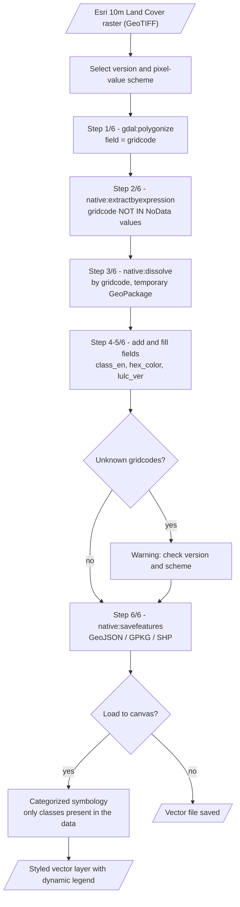
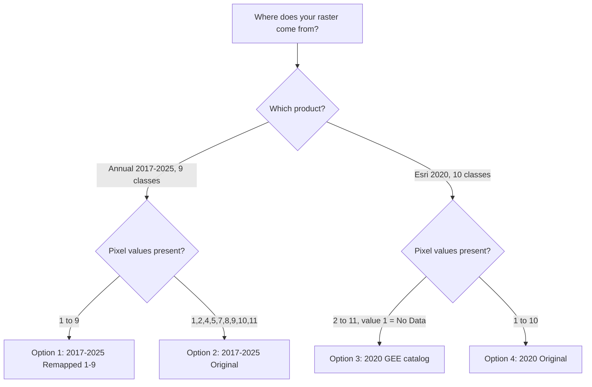
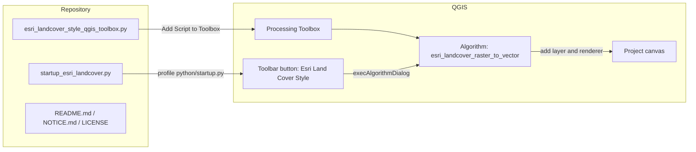
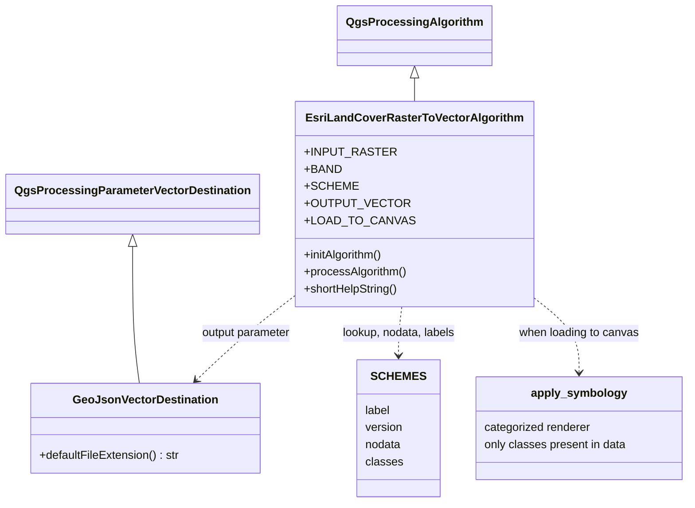
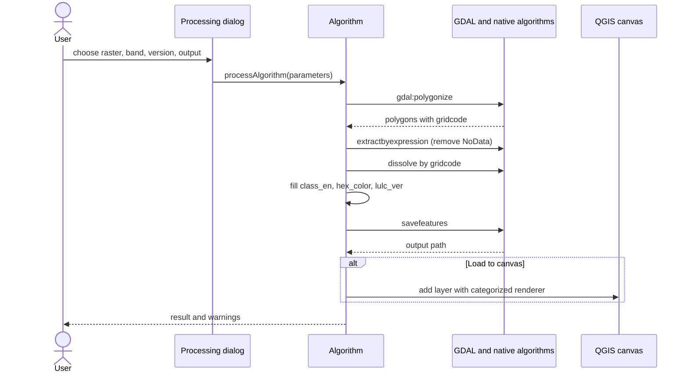

# Esri Land Cover Style — QGIS Toolbox

A QGIS toolbox that automatically symbolizes **Esri 10m Land Cover** rasters as labeled, colored vector polygons. It supports **all versions**: the annual **2017–2025 (9 classes)** collection and the **Esri 2020 (10 classes)** map, each in both the GEE and the Original pixel-value scheme. 

> Data produced by Impact Observatory for Esri (© 2021 Esri, CC BY 4.0). This toolbox is not officially affiliated with Esri or Impact Observatory. See [`NOTICE.md`](./NOTICE.md).


https://github.com/user-attachments/assets/9711dd43-0e88-4719-919b-fc37ef878931


## Features

- Polygonize → remove NoData → dissolve by class → fill attributes → automatic symbology
- **4 version/scheme options** in a single dropdown (see the table below)
- NoData is removed **before** dissolving, so the dissolved output is clean
- Class names are always in **English** (as in the official Esri definitions)
- Dynamic legend — only classes present in the data are shown
- Default output is GeoJSON (`.gpkg` / `.shp` also possible)
- Quick-access **Esri Land Cover Style** button on the QGIS toolbar

## Tool Architecture & Workflow

### 1. Processing workflow



### 2. Which scheme should I pick?



### 3. Components



### 4. Code structure



### 5. Run sequence



### 6. Data model

```mermaid
erDiagram
    SCHEME ||--|{ CLASS : defines
    SCHEME ||--o{ OUTPUT_LAYER : "sets lulc_ver"
    CLASS ||--o{ OUTPUT_LAYER : "fills class_en and hex_color"
    SCHEME {
        string label
        string version
        list nodata
    }
    CLASS {
        int pixel_value
        string class_name
        string hex
    }
    OUTPUT_LAYER {
        int gridcode
        string class_en
        string hex_color
        string lulc_ver
    }
```

## File Structure

```
Esri-Landcover-style-QGIS-Toolbox/
├── esri_landcover_style_qgis_toolbox.py   # Main Processing script
├── startup_esri_landcover.py              # Toolbar button (optional)
├── NOTICE.md
├── LICENSE
└── README.md
```

## Installation

1. Open the **Processing Toolbox** → click the **Python** icon → **Add Script to Toolbox...**
2. Select `esri_landcover_style_qgis_toolbox.py`. The tool appears under **Esri Land Cover Custom Visualization Toolbox**.
3. *(Optional, toolbar button)* — open your QGIS profile folder: `Settings → User Profiles → Open Active Profile Folder → python`.
   - No `startup.py` yet → copy `startup_esri_landcover.py` there and rename it to `startup.py`.
   - **You already have a `startup.py`** (e.g. from the MapBiomas toolbox) → **do not overwrite it**; paste the contents of `startup_esri_landcover.py` at the very bottom of the existing file. Both buttons can coexist.

## Usage

| Parameter | Description |
|---|---|
| Esri 10m Land Cover raster | Input raster layer |
| Band | Default Band 1 |
| **Esri Land Cover version & pixel-value scheme** | Pick one of the 4 options below, matching where your raster came from |
| Output vector polygons | Save location (default GeoJSON) |
| Load to canvas | Tick to display the result immediately with symbology |

### Version / scheme options

| Option | Use when | NoData removed |
|---|---|---|
| 2017–2025 (9 classes) — **Remapped 1–9** | Raster already remapped to 1–9, e.g. exported from GEE after applying `remap([1,2,4,5,7,8,9,10,11], [1,2,3,4,5,6,7,8,9])` | 0 |
| 2017–2025 (9 classes) — **Original 1,2,4,5,7,8,9,10,11** | Official GeoTIFF from Esri / Impact Observatory, or the raw `ESRI_Global-LULC_10m_TS` asset exported without remapping | 0 |
| 2020 (10 classes) — **GEE catalog (1–11)** | Raster from the GEE catalog `ESRI_Global-LULC_10m` (value 1 = No Data) | 0 and 1 |
| 2020 (10 classes) — **Original 1–10** | Official Esri 2020 GeoTIFF | 0 |

> **Do not pick the wrong scheme.** The same number can mean different classes across schemes (e.g. value 4 = *Flooded Vegetation* in 9-class Original, but *Crops* in 9-class Remapped and *Grass* in 2020 GEE). If a "Gridcodes not recognized" warning appears, the version is almost certainly mismatched.

## Classes & Colors

### 2017–2025, 9 classes — Remapped 1–9
| Pixel value | Land Cover Class | Hex | Color |
|:---:|---|:---:|:---:|
| 1 | Water | `#1A5BAB` |  |
| 2 | Trees | `#358221` |  |
| 3 | Flooded Vegetation | `#87D19E` |  |
| 4 | Crops | `#FFDB5C` |  |
| 5 | Built Area | `#ED022A` |  |
| 6 | Bare Ground | `#EDE9E4` |  |
| 7 | Snow/Ice | `#F2FAFF` |  |
| 8 | Clouds | `#C8C8C8` |  |
| 9 | Rangeland | `#C6AD8D` |  |

### 2017–2025, 9 classes — Original
| Pixel value | Land Cover Class | Hex | Color |
|:---:|---|:---:|:---:|
| 1 | Water | `#1A5BAB` |  |
| 2 | Trees | `#358221` |  |
| 4 | Flooded Vegetation | `#87D19E` |  |
| 5 | Crops | `#FFDB5C` |  |
| 7 | Built Area | `#ED022A` |  |
| 8 | Bare Ground | `#EDE9E4` |  |
| 9 | Snow/Ice | `#F2FAFF` |  |
| 10 | Clouds | `#C8C8C8` |  |
| 11 | Rangeland | `#C6AD8D` |  |

### 2020, 10 classes — GEE catalog (value 1 = No Data, removed)
| Pixel value | Land Cover Class | Hex | Color |
|:---:|---|:---:|:---:|
| 2 | Water | `#1A5BAB` |  |
| 3 | Trees | `#358221` |  |
| 4 | Grass | `#A7D282` |  |
| 5 | Flooded Vegetation | `#87D19E` |  |
| 6 | Crops | `#FFDB5C` |  |
| 7 | Scrub/Shrub | `#EECFA8` |  |
| 8 | Built Area | `#ED022A` |  |
| 9 | Bare Ground | `#EDE9E4` |  |
| 10 | Snow/Ice | `#F2FAFF` |  |
| 11 | Clouds | `#C8C8C8` |  |

### 2020, 10 classes — Original
| Pixel value | Land Cover Class | Hex | Color |
|:---:|---|:---:|:---:|
| 1 | Water | `#1A5BAB` |  |
| 2 | Trees | `#358221` |  |
| 3 | Grass | `#A7D282` |  |
| 4 | Flooded Vegetation | `#87D19E` |  |
| 5 | Crops | `#FFDB5C` |  |
| 6 | Scrub/Shrub | `#EECFA8` |  |
| 7 | Built Area | `#ED022A` |  |
| 8 | Bare Ground | `#EDE9E4` |  |
| 9 | Snow/Ice | `#F2FAFF` |  |
| 10 | Clouds | `#C8C8C8` |  |

Sources: [S2TSLULC](https://gee-community-catalog.org/projects/S2TSLULC/#class-definitions) and [esrilc2020](https://gee-community-catalog.org/projects/esrilc2020/#class-definitions). The Original 2020 numbering (1–10) follows the official class order on the esrilc2020 page.

## Output Attributes

| Field | Description |
|---|---|
| `gridcode` | Pixel value from the raster (polygonize result) |
| `class_en` | Class name (English) |
| `hex_color` | Hex color code |
| `lulc_ver` | Version & scheme selected when running the tool |

## Performance Tips

Esri 10 m rasters are very detailed. For large areas, **clip the raster to your study area first** before running the tool (polygonizing a large raster can be very slow and produce huge files).

## Requirements

QGIS 3.x with GDAL (included in the standard QGIS installation).

## Author

**Defani Arman Alfitriansyah** — [github.com/Defani](https://github.com/Defani)

## License

Code: MIT (see `LICENSE`). Data: CC BY 4.0, © Esri / Impact Observatory (see `NOTICE.md`).
